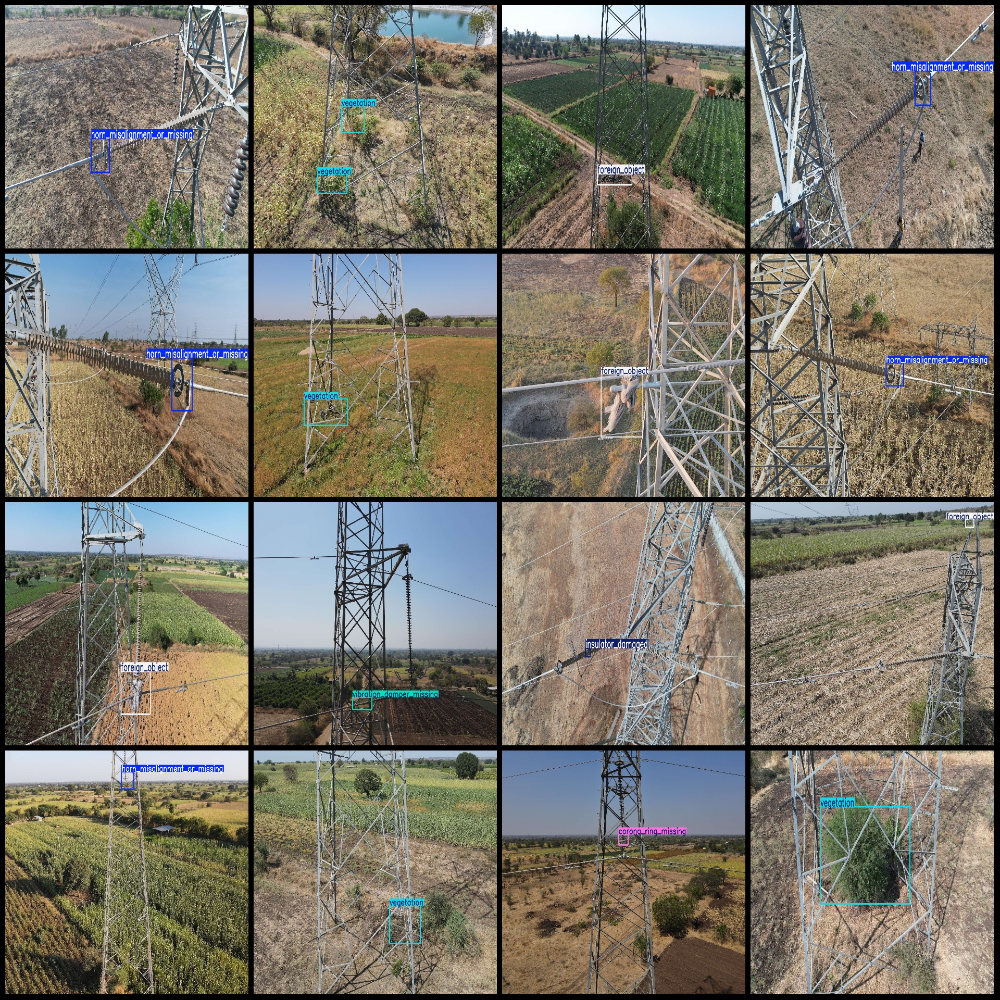
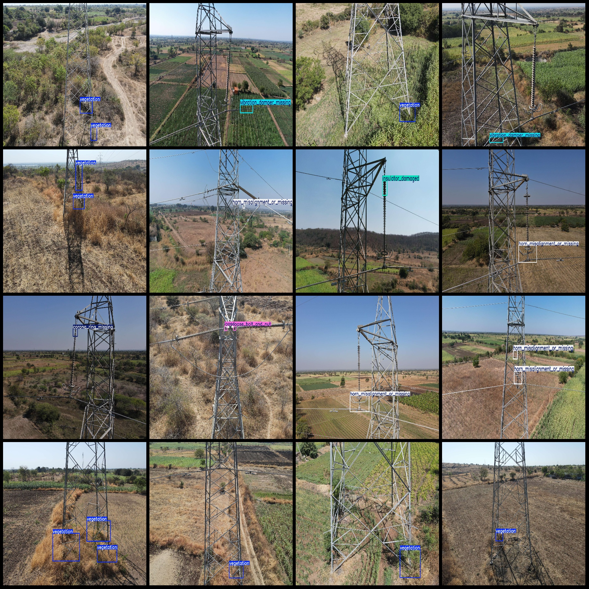

# Power Inspection Data Set for Electric Circuits with Faults, Misaligned Grounding Rings, Loose Bolts, Vibration Dampers Missing, and Detection in VOC+YOLO Format

Power Scene: Power inspection wire misconnection, grounding fault, inverter imbalance, loose bolts, shock absorbers missing detection dataset VOC+YOLO format 916 categories.

Dataset format: Pascal VOC format + YOLO format (without split path in the txt file, only containing jpg images and corresponding VOC format xml files and yolo format txt files)
Number of images (jpg file count): 916
Number of labels (xml file count): 916
Number of labels (txt file count): 916
Number of label categories: 9
Label category names (notice that the order of categories in the yolo format is not consistent with this, and it should be based on the labels folder's classes.txt): ["conducting_wire_misconnection", "corona_ring_missing", "earth_wire_faulty", "foreign_object", "horn_misalignment_or_missing", "insulator_damaged", "loose_bolt_and_nut", "vegetation", "vibration_damper_missing"]
Each category has a number of bounding boxes:
"conducting_wire_misconnection" = 48
"corona_ring_missing" = 77
"earth_wire_faulty" = 7
"foreign_object" = 98
"horn_misalignment_or_missing" = 337
"insulator_damaged" = 83
"loose_bolt_and_nut" = 57
"vegetation" = 413
Vibration Damper Missing (Frame Count = 32)
total boxes: 1152  
Image resolution: Multi-resolution images, such as 1920x1440, 1920x1080, etc.
Using the labeling tool: labelImg
Rule: Draw a box around the category.
Important Notes: There are currently no notes.
Special Statement: This dataset does not guarantee the accuracy of the trained model or weight files.
## Images

Here is a pay link on Stripe ( https://buy.stripe.com/3cs8yP7sY87d0vu9AB ). Please contact me lonlonago@foxmail.com after funding $89, and I will send you a complete data files , thank you!

